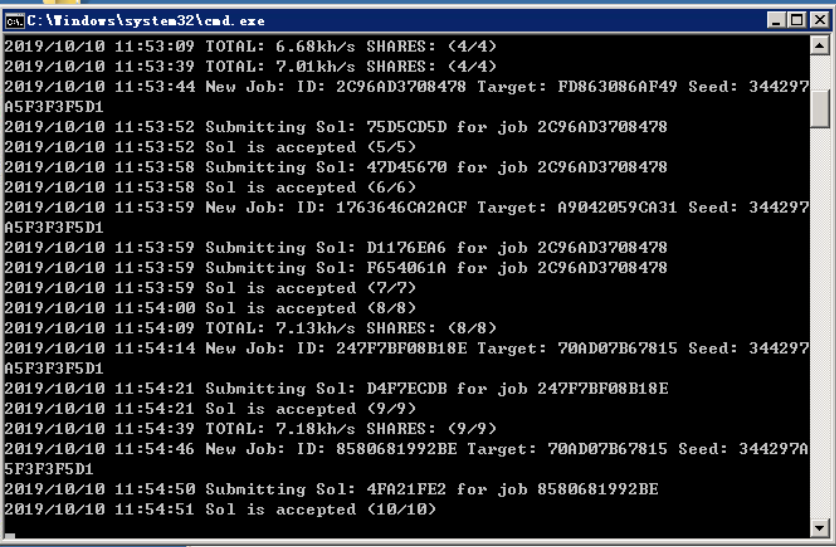
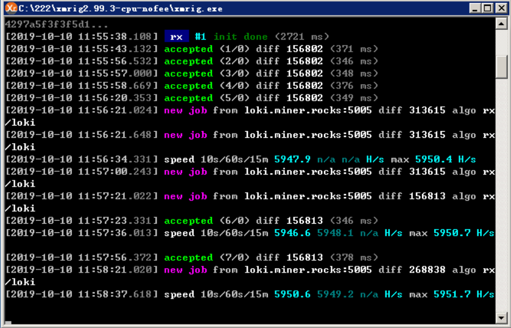

# GxMiner

GxMiner is a highly optimized miner for random-x series algorithm. Binaries are avaliable in [release page](https://github.com/maoxs2/GxMiner/releases)

GxMiner,高度优化,专精RandomX算法的新型挖矿软件。[国内下载地址](https://gitee.com/Command/GxMiner/releases)

## Intro

GxMiner acts as an application of library [go-randomx](https://github.com/maoxs2/go-randomx) which based on C and golang. In this framework, we can mine all cryptocurrencies with random-x series algorithm.

This repo is currently not fully open-sourcing, but its core part, the project go-randomx is open-sourcing, if you wanna help boost GxMiner's speed you can directly post PR to the go-randomx

We plan to **open-source** after monero's fork on 30 Nov.

## Why GxMiner

As everyone know, xmrig & xmr-stak is the leader of monero miners. But soon monero is not cryptonight algorithm cryptocurrency any longer, it would be the centry of random-x

Comparing to the leaders, GxMiner is **younger** and **modern**, **without any historical burden**. And GxMiner is not slower even sometimes slightly **faster** than the xmrig.

And if you are a developer, it would be much **easier to intergrate** your random-x fork into miner.

## Usage

Take RandomXL(Loki) for example:

```cmd
> gxminer.exe help
NAME:
   GxMiner - Go randomX Miner

USAGE:
   gxminer.exe [global options] command [command options] [arguments...]

VERSION:
   v0.1.9-random-xl-go1.13.1

DESCRIPTION:
   GxMiner is a highly optimized miner for random-x series algorithm. Make sure you have downloaded from the official page[https://github.com/maoxs2/gxminer]. If you have any problem or advice please take the issue here[https://github.com/maoxs2/gxminer/issues/new]

AUTHOR:
   Command M <maoxs2@163.com>

COMMANDS:
   help, h  Shows a list of commands or help for one command

GLOBAL OPTIONS:
   --conf FILE                                     Load configuration from FILE [config.json]
   --log-file FILE                                 save log messages to FILE
   --log-level value                               log level (debug, info, warn, error, panic) (default: "info")
   --pool value, -o value                          Pool address with port, e.g. 192.168.1.100:3333 or mining.pool.com:3333
   --user value, -u value                          Wallet address or login username
   --pass value, --password value, -p value        Password for login username (default: "x")
   --rig-id value                                  RigID for Pool displaying (default: "GxMiner")
   --workerNum value, --threadNum value, -t value  the number of hash worker (default: 0)
   --hard-aes                                      on default enabled the hardware aes, using soft aes set this to false
   --full-mem                                      on default enabled the full mem, set false to disable
   --jit                                           on default enabled the jit boost, set false to disable
   --huge-page                                     on default enabled the huge/large page, set false to disable
   --argon2-sse3                                   enable argon2-sse3
   --argon2-avx2                                   enable argon2-avx2
   --affinity-mask value                           cpu affinity mask in hex (default: "f")
   --tls                                           enable tls encryption in tcp transfer
   --help, -h                                      show help
   --version, -v                                   print the version

```

Loki mining example:

```bash
gxminer.exe -o 118.24.119.46:30000 -u L7zjr6vtpyvBtFjgbjcWAu1SYjLRutW518J9Y8LqP4GgYanhRJJSmF37X83YUTJaTr16y8RUtWynAM6DK6Jkx7qVUTMfFie
```
## Config

Config example (Loki):

```
{
  "pools": [
	{
      "pool": "proxy.randomx.m00n.top:23333",
      "user": "L7zjr6vtpyvBtFjgbjcWAu1SYjLRutW518J9Y8LqP4GgYanhRJJSmF37X83YUTJaTr16y8RUtWynAM6DK6Jkx7qVUTMfFie",
      "pass": "x",
      "rig-id": "",
      "tls": false
    },
    {
      "pool": "loki.pool.mine2gether.com:3331",
      "user": "L7zjr6vtpyvBtFjgbjcWAu1SYjLRutW518J9Y8LqP4GgYanhRJJSmF37X83YUTJaTr16y8RUtWynAM6DK6Jkx7qVUTMfFie",
      "pass": "x",
      "rig-id": "",
      "tls": false
    }
  ],
  "workers": {
    "worker-num": 8,
    "huge-page": true,
    "hard-aes": true,
    "full-mem": true,
    "jit": true,
    "argon2-sse3": true,
    "argon2-avx2": true,
    "affinity-mask": "ff"
  },
  "log": {
    "level": "info",
    "file": ""
  }
}
```

The second pool acts as the failover pool config.

## Build

[After open-sourcing]

## FAQ

1. Start the miner with "failed to alloc mem for dataset" error or "failed to alloc mem for cache" error, how to deal?

- Check your platform support large/huge page or not. if not, set `--huge-page=false`(not recommended).
- Check whether you have enough page. If not, clear it.
- https://github.com/tevador/RandomX/issues/100#issuecomment-510484859

2. How to get maximum hashrate?

- Keep `--hard-aes`, `--full-mem`, `--jit` and `--huge-page` all be true (enabled) as default. 
- In system setting, set your virtual memory larger than 4GB.
- Test the `--workerNum` and select the one with fastest hashrate.

3. Why always "invalid job id"?

- Check the network delay and packet loss between miner and pool. 
- Choose a pool with great network status is important.

## Hashrate Comparition

### RandomXL

Dual-E5-2660v2:





It's welcomed that [share your hashrate/comparation on github issue](https://github.com/maoxs2/open-grin-pool/issues/new).
